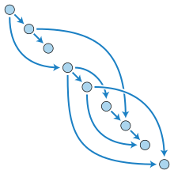
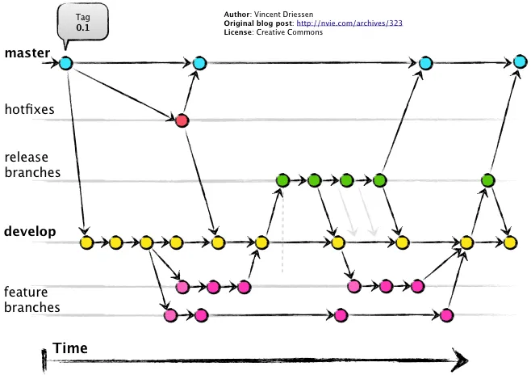

<!-- section 0 -->

# Git Workshop {#git-workshop .light-on-dark bgcss="sea-gradient" x="0" y="0" rz="-.1"}

{height="110px" width="46px"}

[`https://alexandermikuta.github.io/git-workshop/`{.render_qr}](https://alexandermikuta.github.io/git-workshop/)

<!-- section 1 -->

# Architecture

> The history in Git is formed from the commit objects and creates a directed acyclic graph



``` {.bash}
git log --decorate --graph --oneline --all
```

<!-- section 2 -->

# Branching Strategies {#branching-strategies .light-on-dark rx="1" bgcss="sea-gradient"}

-   GitFlow

-   GithubFlow

-   Trunk-Based Development

<!-- section 3 -->

# GitFlow



<!-- section 4 -->

# Github-Flow


<!-- section 5 -->

# Trunk-Based-Development


<!-- section 6 -->

# cool looking {#cool-looking .light-on-dark bg="white;assets/paperclip.gif" rx="-1" ry="0"}

leverages battle-proven`</br>`{=html}HTML5 presentation frameworks:

revealjs • impressjs

<!-- section 7 -->

# asciiart (ditaa) {#asciiart-ditaa .ltr rx="0" ry="1"}

``` {.render_ditaa args="--transparent --scale 1 --font 'Raleway'"}
+-----------------------------+
| Node A                      |
|                             |
| +----------+   +----------+ |
| |          |   |          | |
| | Frontend |   | Foo      | |
| |          |   |          | |
| |          |   | {s}      | |
| +-----+----+   +----------+ |
|       ^                     |
|       |                     |
|       \-service-\           |
|                 |           |
+-----------------|-----------+
                  |
+-----------------|-----------+
| Node B          |           |
|       /---------/           |
|       |                     |
|       v                     |
| +-----+----+   +=---------+ |
| |          |   |          | |
| | Frontend |   | Bar      | |
| |          |   |          | |
| |          |   | {s}      | |
| +----------+   +----------+ |
+-----------------------------+
```

<!-- section 8 -->

# asciiart (a2s) {#asciiart-a2s .ltr}

``` {.render_a2s}
#--------------------.
|[0]                 |
| .---# .---# #---.  |
| |[1]| |[1]| |[1]|  |
| #---' #---' '---#  |
|   ^     ^     ^    |
#---+-----+-----+----#
|   |     |     |    |
|   a     2 sketch   |
'--------------------#

[0]: {"fill": "#933","a2s:delref":true}
[1]: {"fill": "#bbb","a2s:delref":true,"a2s:type":"storage"}
```

<!-- section 9 -->

# asciiart (sketchy) {#asciiart-sketchy .ltr}

``` {.render_a2sketch}
#-----------------------------#
|[0]                          |
| Node                        |
|                             |
| #----------#   #----------# |
| |          |   |[1]       | |
| |front     |   | foo      | |
| |          |   |          | |
| |  ^       |   |          | |
| |  |       |   |          | |
| #--|-------#   #----------# |
|    |                ^       |
|    |                |       |
|    '-- service    --'       |
|                             |
#-----------------------------#
[0]: {"fill":"#fff","fillStyle":"solid","a2s:delref":true}
[1]: {"fill":"#eee","fillStyle":"solid","a2s:delref":true}
```

<!-- section 10 -->

# asciiart (svgbob) {#asciiart-svgbob .ltr rx="-1" ry="0"}

``` {.render_svgbob args="--scale 10 --font-family Raleway --font-size 24"}
        P *
           \
            \
       v0    \       v3
         *----\-----*
        /      v X   \
       /        o     \
      /                \
  v1 *------------------* v2
```

<!-- section 11 -->

# asciiart (mermaid) {#asciiart-mermaid .ltr}

``` {.render_mermaid args="-w 400" style="font-size: 100%;"}
graph LR
   a --> b & c--> d
```

<!-- section 12 -->

# asciiart (plantuml) {#asciiart-plantuml .ltr}

``` {.render_plantuml args="-Sbackgroundcolor=transparent -SdefaultFontSize=24 -SdefaultFontName=Raleway"}
@startuml
Bob->Alice : hello
Alice->Bob : oh, you again...
Bob->Alice : ??
@enduml
```

<!-- section 13 -->

# asciiart (graphviz) {#asciiart-graphviz .ltr}

``` {.render_dot args="-Nfontname=Raleway"}
digraph G {
    bgcolor=transparent;
    node [style=filled,color=white];

    a -> b -> c;
    a -> c;
    b -> d;
}
```

<!-- section 14 -->

# charts (vega-lite) {#charts-vega-lite .ltr rx="0" ry="-1"}

``` {.render_vegalite}
{
    "$schema": "https://vega.github.io/schema/vega-lite/v2.0.json",
    "data": {
        "values": [
            {"a": "A","b": 28}, {"a": "B","b": 55}, {"a": "C","b": 43},
            {"a": "D","b": 91}, {"a": "E","b": 81}, {"a": "F","b": 53},
            {"a": "G","b": 19}, {"a": "H","b": 87}, {"a": "I","b": 52}
        ]
    },
    "width": 250,
    "height": 300,
    "mark": "area",
    "encoding": {
        "x": {"field": "a", "type": "ordinal"},
        "y": {"field": "b", "type": "quantitative", "scale": {"domain": [0, 100]}}
    },
    "config": {
        "axis": {
            "labelFont": "Raleway",
            "labelFontSize": 18,
            "titleFont": "Raleway",
            "titleFontSize": 24,
            "titleAngle": 0
        },
        "axisX": {
            "labelAngle": 0
        }
    }
}
```
