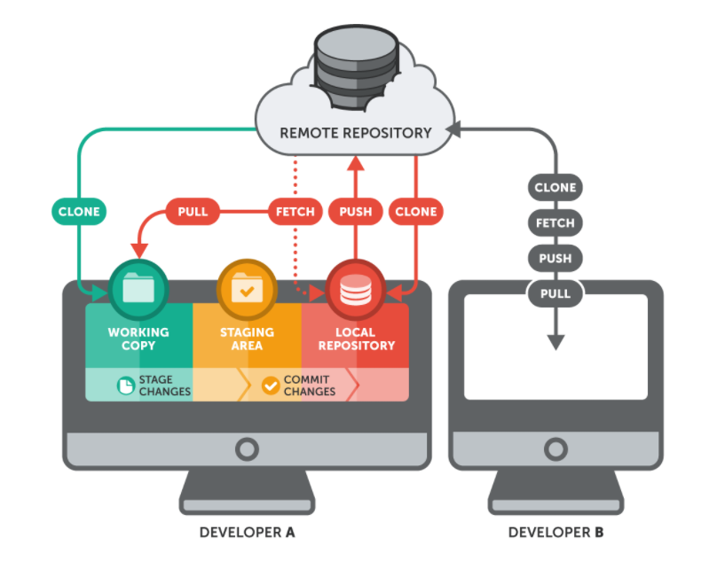
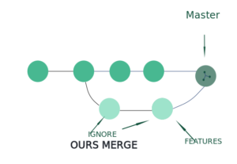

<!-- section 0 -->

# Git Workshop {#git-workshop .light-on-dark bgcss="sea-gradient" x="0" y="0" rz="-.1"}

{height="46px" width="110px"}

<!-- section 1 -->

# Git vs. GitHub {#git-vs.-github .light-on-dark bgcss="sea-gradient" x="0" y="0" rz="-.1"}

<!-- section 2 -->

# Git vs. GitHub

  Git                                GitHub
  ---------------------------------- --------------------------------------
  Software                           Service
  command line tool                  GUI
  installed locally                  hosted on the web
  VCS to mange source code history   hosting service for GIT repositories

> GitHub uses Git as central tool for its service

<!-- section 3 -->

# Architecture {#architecture .light-on-dark bgcss="sea-gradient" x="0" y="0" rz="-.1"}

<!-- section 4 -->

# Architecture - directed acyclic graph

> The history in Git is formed from the commit objects and creates a directed acyclic graph


<!-- section 5 -->

# Architecture - 3-Tier-Architecture

{height="60%" width="60%"}

-   Files from staging area will move to Git Repository with commit
-   Useful if you do not want a commit for every added file, but e.g. want a changeset containing 5 added files

<!-- section 6 -->

# Architecture - Git-Workflow

{height="70%" width="70%"}

> Recommended sequence: commit → pull → push

<!-- section 7 -->

# Architecture - Distributed Development

{height="60%" width="60%"}

-   Advantage: No network connection needed for commits.
-   Checkins in local repository also work if production branch in SVN is broken.

<!-- section 8 -->

# Architecture - Creating a new repository

> When you run `git init` in a folder, Git creates the `.git` directory


> This `.git` directory contains your local repository data


<!-- section 9 -->

# Differences to TFS

> Git is recommended over TFS by Microsoft itself for new projects!

  --------------------------------------------------------------------------------
  TFS                                            Git
  ---------------------------------------------- ---------------------------------
  Centralised VCS                                Distributed VCS

  branches are folders in TFS folder hierarchy   private local branches possible
  --------------------------------------------------------------------------------

<!-- section 10 -->

# Migration form TFS to Git

-   history not needed: `git init` on current files
-   history is needed: http://git-tfs.com/
    -   `git tfs clone ...` instead of the usual `git clone ...`
    -   git-tfs works as two-way bridge so changes can also be pushed to TFS: `git tfs checkintool`

Plan your migration carefully:

-   usually large binary data is not put into Git -\> cleanup before migration
-   for big projects multiple Git-Repositories could be created and included via Submodule/Subtree

<!-- section 11 -->

# Git-Configuration

-   can be local for git-repository within `.git/config`
-   can be global via global flag `git config --global ...`
-   can be accessed via `git config --list`

Typical settings:

-   `git config --global core.editor "code --wait"`
-   `git config --global user.name "John Doe"`
-   `git config --global user.email johndoe@example.com`
-   `git config --global merge.tool kdiff3`
-   `git config --global credential.helper cache`

<!-- section 12 -->

# Branching Strategies {#branching-strategies .light-on-dark rx="1" bgcss="sea-gradient"}

-   GitFlow

-   GithubFlow

-   Trunk-Based Development

<!-- section 13 -->

# Branching Strategies: GitFlow


<!-- section 14 -->

# Branching Strategies: GitFlow

**Pros**

-   isolated features
-   code in master remains clean and organized. Only updated with tested code
-   easy traceability as merges are bundled/labeled
-   good for traditional software distribution

**Cons**

-   Many branches with complicated rules
-   Heavy maintenance workload for released versions
-   structured and specific development path conflict with agile iterative approach

<!-- section 15 -->

# Branching Strategies: Github-Flow


<!-- section 16 -->

# Branching Strategies: GithubFlow

**Pros**

-   clear and simple collaboration rules
-   Continuous integration and deployment
-   Less risk of technical debt with this branching strategy

**Cons**

-   Speed comes at cost of less organized workflow in comparison to Git-Flow
-   This branching stratey emphasizes constant deployment. Limitation for teams that tent to make larger releases or test several features together
-   release preparation and bug fixes happen both in master branch -\> requires attention

<!-- section 17 -->

# Branching Strategies: Trunk-Based-Development


<!-- section 18 -->

# Tooling

<!-- section 19 -->

# Tooling - IDEs

-   VisualStudio
-   VS-Code

<!-- section 20 -->

# Tooling - Other

-   Clients (Github Desktop, SourceTree, SmartGit, GitKraken, GitTower)
-   Explorer-Integration (TortoiseGit)
-   Merge-Tools (meld)
-   ZSH-Plugin
-   Azure Devops (mit Git)
-   Azure-Devops-Pipeline -\> Github-Action Converter

<!-- section 21 -->

# Working with Git {#working-with-git .light-on-dark bgcss="sea-gradient" x="0" y="0" rz="-.1"}

<!-- section 22 -->

# Merge strategies

> If not specified explicitly Git will automatically choose a strategy based on the branches provided for merging

-   **Fast Forward (Rebase)**
-   **Recursive**
-   Ours
-   Octopus
-   Resolve
-   Subtree

<!-- section 23 -->

# Merge: Fast Forward (Rebase)


<!-- section 24 -->

# Merge: Recursive


<!-- section 25 -->

# Merge: Ours



<!-- section 26 -->

# Merge: Octopus

`git merge -s octopus`


> Resolves cases with more than two heads. It is primarily used for bundling topic branch heads together

<!-- section 27 -->

# Merge: Resolve

`git merge -s resolve`

> Resolve two heads by using a 3-way-merge. Complex conflicts have to be solved manually.


<!-- section 28 -->

# Merge: Subtree

`git merge -s subtree`


> The idea of the subtree merge is that you have two projects, and one of the projects maps to a subdirectory of the other one.
> When you specify a subtree merge, Git is often smart enough to figure out that one is a subtree of the other and merge appropriately

<!-- section 29 -->

# Undoing commits

From local repository:

-   keeping your local changes: `git reset --soft HEAD`
-   discarding your local changes: `git reset --hard HEAD`

From public repository:

-   `git revert HEAD` and `git commit -m "reverted last commit"`

> HEAD points to last commit in branch: `git reset HEAD~<no-of-commits>`


<!-- section 30 -->

# Debugging with Git

-   File annotations: `git blame -L 3,5 <somefilename>`
-   git bisect:
    -   start with `git bisect start`
    -   use `git bisect bad` to tell the system that current commit is broken
    -   use `git bisect good <good_commit>` when the last known good state was
    -   goes to middle of possibly broken commits -\> check -\> git bisect bad/good
    -   when finished use `git bisect reset`

<!-- section 31 -->

# Best practices {#best-practices .light-on-dark bgcss="sea-gradient" x="0" y="0" rz="-.1"}

<!-- section 32 -->

# Best practices

-   commit often: Each commit is a snapshot that can be reverted to. Commits can be combined using `rebase`.
-   work from latest version with `git pull` to avoid merge conflicts
-   commit notes should contain "why" and "what" of change
-   review changes before commiting
-   Use Branches: Enables developers to work in parallel on separate lines of product
-   Agree on a common workflow, e.g. Git-Flow -\> otherwise overhead in merges

<!-- section 33 -->

# Important commands {#important-commands .light-on-dark bgcss="sea-gradient" x="0" y="0" rz="-.1"}

<!-- section 34 -->

# Important commands: showing the history

``` {.bash}
git log --decorate --graph --oneline --all
```

-   Commits/signierte Commits
-   Blobs
-   Referenzen
-   .gitignore
-   Pull-Requests
-   Cherry-Picking
-   Staging
-   Stashing
-   Squashing
-   Deletion von Elementen -\> Teasern
-   Hooks (z.B. Linting)
-   Tags/signierte Tags
-   Submodules
-   Subtrees
-   Git-Alias
-   Git-LFS
-   Linting von Commits/Commit-Messages (z.B. mittels Husky.Net)

<!-- section 35 -->

# GitOps {#gitops .light-on-dark bgcss="sea-gradient" x="0" y="0" rz="-.1"}

<!-- section 36 -->

# GitOps - What is GitOps?

> GitOps is code-based infrastructure and operational procedures that rely on Git as a source control system

> GitOps ensures that a cloud infrastructure is immediately reproducible based on the state of a Git repository.
> Pull requests modify the state of the Git repository.
> Once approved and merged, the pull requests will automatically reconfigure and sync the live infrastructure to the state of the repository.
> This live syncing pull request workflow is the core essence of GitOps

<!-- section 37 -->

# GitOps - Pipeline

To achieve a full GitOps install, a pipeline platform is required, e.g.:

-   Azure-Devops-Pipelines
-   Github-Actions
-   Gitlab Pipelines
-   Bitbucket Pipelines
-   Jenkins/Jenkins X
-   ArgoCD
-   Flux
-   Tekton Pipelines

<!-- section 38 -->

# GitOps - Example Pipeline


<!-- section 39 -->

# Ressources

-   Cheatsheet: https://www.atlassian.com/git/tutorials/atlassian-git-cheatsheet
-   Githug
-   learngitbranching.js.org

<!-- section 40 -->

# cool looking {#cool-looking .light-on-dark bg="white;assets/paperclip.gif" rx="-1" ry="0"}

leverages battle-proven`</br>`{=html}HTML5 presentation frameworks:

revealjs • impressjs

<!-- section 41 -->

# asciiart (ditaa) {#asciiart-ditaa .ltr rx="0" ry="1"}

``` {.render_ditaa args="--transparent --scale 1 --font 'Raleway'"}
+-----------------------------+
| Node A                      |
|                             |
| +----------+   +----------+ |
| |          |   |          | |
| | Frontend |   | Foo      | |
| |          |   |          | |
| |          |   | {s}      | |
| +-----+----+   +----------+ |
|       ^                     |
|       |                     |
|       \-service-\           |
|                 |           |
+-----------------|-----------+
                  |
+-----------------|-----------+
| Node B          |           |
|       /---------/           |
|       |                     |
|       v                     |
| +-----+----+   +=---------+ |
| |          |   |          | |
| | Frontend |   | Bar      | |
| |          |   |          | |
| |          |   | {s}      | |
| +----------+   +----------+ |
+-----------------------------+
```

<!-- section 42 -->

# asciiart (a2s) {#asciiart-a2s .ltr}

``` {.render_a2s}
#--------------------.
|[0]                 |
| .---# .---# #---.  |
| |[1]| |[1]| |[1]|  |
| #---' #---' '---#  |
|   ^     ^     ^    |
#---+-----+-----+----#
|   |     |     |    |
|   a     2 sketch   |
'--------------------#

[0]: {"fill": "#933","a2s:delref":true}
[1]: {"fill": "#bbb","a2s:delref":true,"a2s:type":"storage"}
```

<!-- section 43 -->

# asciiart (sketchy) {#asciiart-sketchy .ltr}

``` {.render_a2sketch}
#-----------------------------#
|[0]                          |
| Node                        |
|                             |
| #----------#   #----------# |
| |          |   |[1]       | |
| |front     |   | foo      | |
| |          |   |          | |
| |  ^       |   |          | |
| |  |       |   |          | |
| #--|-------#   #----------# |
|    |                ^       |
|    |                |       |
|    '-- service    --'       |
|                             |
#-----------------------------#
[0]: {"fill":"#fff","fillStyle":"solid","a2s:delref":true}
[1]: {"fill":"#eee","fillStyle":"solid","a2s:delref":true}
```

<!-- section 44 -->

# asciiart (svgbob) {#asciiart-svgbob .ltr rx="-1" ry="0"}

``` {.render_svgbob args="--scale 10 --font-family Raleway --font-size 24"}
        P *
           \
            \
       v0    \       v3
         *----\-----*
        /      v X   \
       /        o     \
      /                \
  v1 *------------------* v2
```

<!-- section 45 -->

# asciiart (mermaid) {#asciiart-mermaid .ltr}

``` {.render_mermaid args="-w 400" style="font-size: 100%;"}
graph LR
   a --> b & c--> d
```

<!-- section 46 -->

# asciiart (plantuml) {#asciiart-plantuml .ltr}

``` {.render_plantuml args="-Sbackgroundcolor=transparent -SdefaultFontSize=24 -SdefaultFontName=Raleway"}
@startuml
Bob->Alice : hello
Alice->Bob : oh, you again...
Bob->Alice : ??
@enduml
```

<!-- section 47 -->

# asciiart (graphviz) {#asciiart-graphviz .ltr}

``` {.render_dot args="-Nfontname=Raleway"}
digraph G {
    bgcolor=transparent;
    node [style=filled,color=white];

    a -> b -> c;
    a -> c;
    b -> d;
}
```

<!-- section 48 -->

# charts (vega-lite) {#charts-vega-lite .ltr rx="0" ry="-1"}

``` {.render_vegalite}
{
    "$schema": "https://vega.github.io/schema/vega-lite/v2.0.json",
    "data": {
        "values": [
            {"a": "A","b": 28}, {"a": "B","b": 55}, {"a": "C","b": 43},
            {"a": "D","b": 91}, {"a": "E","b": 81}, {"a": "F","b": 53},
            {"a": "G","b": 19}, {"a": "H","b": 87}, {"a": "I","b": 52}
        ]
    },
    "width": 250,
    "height": 300,
    "mark": "area",
    "encoding": {
        "x": {"field": "a", "type": "ordinal"},
        "y": {"field": "b", "type": "quantitative", "scale": {"domain": [0, 100]}}
    },
    "config": {
        "axis": {
            "labelFont": "Raleway",
            "labelFontSize": 18,
            "titleFont": "Raleway",
            "titleFontSize": 24,
            "titleAngle": 0
        },
        "axisX": {
            "labelAngle": 0
        }
    }
}
```
