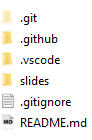

<!-- section 0 -->

# Git Workshop {#git-workshop .light-on-dark bgcss="sea-gradient" x="0" y="0" rz="-.1"}

{height="46px" width="110px"}

<!-- section 1 -->

# Architecture {#architecture .light-on-dark bgcss="sea-gradient" x="0" y="0" rz="-.1"}

<!-- section 2 -->

# Architecture - directed acyclic graph

> The history in Git is formed from the commit objects and creates a directed acyclic graph


<!-- section 3 -->

# Architecture - 3-Tier-Architecture

{height="60%" width="60%"}

-   Files from staging area will move to Git Repository with commit
-   Useful if you do not want a commit for every added file, but e.g. want a changeset containing 5 added files

<!-- section 4 -->

# Architecture - Git-Workflow

{height="70%" width="70%"}

> Recommended sequence: commit → pull → push

<!-- section 5 -->

# Architecture - Distributed Development

{height="60%" width="60%"}

-   Advantage: No network connection needed for commits.
-   Checkins in local repository also work if production branch in SVN is broken.

<!-- section 6 -->

# Architecture - Creating a new repository

> When you run `git init` in a folder, Git creates the `.git` directory



> This `.git` directory contains your local repository data
> 

<!-- section 7 -->

# Branching Strategies {#branching-strategies .light-on-dark rx="1" bgcss="sea-gradient"}

-   GitFlow

-   GithubFlow

-   Trunk-Based Development

<!-- section 8 -->

# Branching Strategies: GitFlow


<!-- section 9 -->

# Branching Strategies: GitFlow

**Pros**

-   isolated features
-   code in master remains clean and organized. Only updated with tested code
-   easy traceability as merges are bundled/labeled
-   good for traditional software distribution

**Cons**

-   Many branches with complicated rules
-   Heavy maintenance workload for released versions
-   structured and specific development path conflict with agile iterative approach

<!-- section 10 -->

# Branching Strategies: Github-Flow


<!-- section 11 -->

# Branching Strategies: GithubFlow

**Pros**

-   clear and simple collaboration rules
-   Continuous integration and deployment
-   Less risk of technical debt with this branching strategy

**Cons**

-   Speed comes at cost of less organized workflow in comparison to Git-Flow
-   This branching stratey emphasizes constant deployment. Limitation for teams that tent to make larger releases or test several features together
-   release preparation and bug fixes happen both in master branch -\> requires attention

<!-- section 12 -->

# Branching Strategies: Trunk-Based-Development


<!-- section 13 -->

# Best practices {#best-practices .light-on-dark bgcss="sea-gradient" x="0" y="0" rz="-.1"}

<!-- section 14 -->

# Best practices

-   commit often: Each commit is a snapshot that can be reverted to. Commits can be combined using `rebase`.
-   work from latest version with `git pull` to avoid merge conflicts
-   commit notes should contain "why" and "what" of change
-   review changes before commiting
-   Use Branches: Enables developers to work in parallel on separate lines of product
-   Agree on a common workflow, e.g. Git-Flow -\> otherwise overhead in merges

<!-- section 15 -->

# Tooling

<!-- section 16 -->

# Tooling - IDEs

-   VisualStudio
-   VS-Code

<!-- section 17 -->

# Tooling - Other

-   Clients (Github Desktop, SourceTree, SmartGit, GitKraken, GitTower)
-   Explorer-Integration (TortoiseGit)
-   Merge-Tools (meld)
-   ZSH-Plugin
-   Azure Devops (mit Git)
-   Unterschied Git/Github
-   Git-TFS-Plugin
-   Azure-Devops-Pipeline -\> Github-Action Converter

<!-- section 18 -->

# Important commands {#important-commands .light-on-dark bgcss="sea-gradient" x="0" y="0" rz="-.1"}

<!-- section 19 -->

# Important commands: showing the history

``` {.bash}
git log --decorate --graph --oneline --all
```

-   Commits/signierte Commits
-   Blobs
-   Referenzen
-   .gitignore
-   Merge/Octopus-Merge
-   Pull-Requests
-   Cherry-Picking
-   Reset
-   Rebasing
-   Revert
-   Staging
-   Stashing
-   Squashing
-   Deletion von Elementen -\> Teasern
-   Hooks (z.B. Linting)
-   Tags/signierte Tags
-   Submodules
-   Subtrees
-   Fehlersuche mit "git bisect"
-   Git-Alias
-   Git-LFS
-   Linting von Commits/Commit-Messages (z.B. mittels Husky.Net)

<!-- section 20 -->

# GitOps {#gitops .light-on-dark bgcss="sea-gradient" x="0" y="0" rz="-.1"}

<!-- section 21 -->

# GitOps - What is GitOps?

> GitOps is code-based infrastructure and operational procedures that rely on Git as a source control system

> GitOps ensures that a cloud infrastructure is immediately reproducible based on the state of a Git repository.
> Pull requests modify the state of the Git repository.
> Once approved and merged, the pull requests will automatically reconfigure and sync the live infrastructure to the state of the repository.
> This live syncing pull request workflow is the core essence of GitOps

<!-- section 22 -->

# GitOps - Pipeline

To achieve a full GitOps install, a pipeline platform is required, e.g.:

-   Azure-Devops-Pipelines
-   Github-Actions
-   Gitlab Pipelines
-   Bitbucket Pipelines
-   Jenkins/Jenkins X
-   ArgoCD
-   Flux
-   Tekton Pipelines

<!-- section 23 -->

# GitOps - Example Pipeline


<!-- section 24 -->

# Ressources

-   Cheatsheet: https://www.atlassian.com/git/tutorials/atlassian-git-cheatsheet
-   Githug
-   learngitbranching.js.org

<!-- section 25 -->

# cool looking {#cool-looking .light-on-dark bg="white;assets/paperclip.gif" rx="-1" ry="0"}

leverages battle-proven`</br>`{=html}HTML5 presentation frameworks:

revealjs • impressjs

<!-- section 26 -->

# asciiart (ditaa) {#asciiart-ditaa .ltr rx="0" ry="1"}

``` {.render_ditaa args="--transparent --scale 1 --font 'Raleway'"}
+-----------------------------+
| Node A                      |
|                             |
| +----------+   +----------+ |
| |          |   |          | |
| | Frontend |   | Foo      | |
| |          |   |          | |
| |          |   | {s}      | |
| +-----+----+   +----------+ |
|       ^                     |
|       |                     |
|       \-service-\           |
|                 |           |
+-----------------|-----------+
                  |
+-----------------|-----------+
| Node B          |           |
|       /---------/           |
|       |                     |
|       v                     |
| +-----+----+   +=---------+ |
| |          |   |          | |
| | Frontend |   | Bar      | |
| |          |   |          | |
| |          |   | {s}      | |
| +----------+   +----------+ |
+-----------------------------+
```

<!-- section 27 -->

# asciiart (a2s) {#asciiart-a2s .ltr}

``` {.render_a2s}
#--------------------.
|[0]                 |
| .---# .---# #---.  |
| |[1]| |[1]| |[1]|  |
| #---' #---' '---#  |
|   ^     ^     ^    |
#---+-----+-----+----#
|   |     |     |    |
|   a     2 sketch   |
'--------------------#

[0]: {"fill": "#933","a2s:delref":true}
[1]: {"fill": "#bbb","a2s:delref":true,"a2s:type":"storage"}
```

<!-- section 28 -->

# asciiart (sketchy) {#asciiart-sketchy .ltr}

``` {.render_a2sketch}
#-----------------------------#
|[0]                          |
| Node                        |
|                             |
| #----------#   #----------# |
| |          |   |[1]       | |
| |front     |   | foo      | |
| |          |   |          | |
| |  ^       |   |          | |
| |  |       |   |          | |
| #--|-------#   #----------# |
|    |                ^       |
|    |                |       |
|    '-- service    --'       |
|                             |
#-----------------------------#
[0]: {"fill":"#fff","fillStyle":"solid","a2s:delref":true}
[1]: {"fill":"#eee","fillStyle":"solid","a2s:delref":true}
```

<!-- section 29 -->

# asciiart (svgbob) {#asciiart-svgbob .ltr rx="-1" ry="0"}

``` {.render_svgbob args="--scale 10 --font-family Raleway --font-size 24"}
        P *
           \
            \
       v0    \       v3
         *----\-----*
        /      v X   \
       /        o     \
      /                \
  v1 *------------------* v2
```

<!-- section 30 -->

# asciiart (mermaid) {#asciiart-mermaid .ltr}

``` {.render_mermaid args="-w 400" style="font-size: 100%;"}
graph LR
   a --> b & c--> d
```

<!-- section 31 -->

# asciiart (plantuml) {#asciiart-plantuml .ltr}

``` {.render_plantuml args="-Sbackgroundcolor=transparent -SdefaultFontSize=24 -SdefaultFontName=Raleway"}
@startuml
Bob->Alice : hello
Alice->Bob : oh, you again...
Bob->Alice : ??
@enduml
```

<!-- section 32 -->

# asciiart (graphviz) {#asciiart-graphviz .ltr}

``` {.render_dot args="-Nfontname=Raleway"}
digraph G {
    bgcolor=transparent;
    node [style=filled,color=white];

    a -> b -> c;
    a -> c;
    b -> d;
}
```

<!-- section 33 -->

# charts (vega-lite) {#charts-vega-lite .ltr rx="0" ry="-1"}

``` {.render_vegalite}
{
    "$schema": "https://vega.github.io/schema/vega-lite/v2.0.json",
    "data": {
        "values": [
            {"a": "A","b": 28}, {"a": "B","b": 55}, {"a": "C","b": 43},
            {"a": "D","b": 91}, {"a": "E","b": 81}, {"a": "F","b": 53},
            {"a": "G","b": 19}, {"a": "H","b": 87}, {"a": "I","b": 52}
        ]
    },
    "width": 250,
    "height": 300,
    "mark": "area",
    "encoding": {
        "x": {"field": "a", "type": "ordinal"},
        "y": {"field": "b", "type": "quantitative", "scale": {"domain": [0, 100]}}
    },
    "config": {
        "axis": {
            "labelFont": "Raleway",
            "labelFontSize": 18,
            "titleFont": "Raleway",
            "titleFontSize": 24,
            "titleAngle": 0
        },
        "axisX": {
            "labelAngle": 0
        }
    }
}
```
