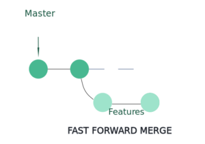

<!-- section 0 -->

# Git Workshop {#git-workshop .light-on-dark bgcss="sea-gradient" x="0" y="0" rz="-.1"}

{height="46px" width="110px"}

<!-- section 1 -->

# Git vs. GitHub {#git-vs.-github .light-on-dark bgcss="sea-gradient" x="0" y="0" rz="-.1"}

<!-- section 2 -->

# Git vs. GitHub

  Git                                GitHub
  ---------------------------------- --------------------------------------
  Software                           Service
  command line tool                  GUI
  installed locally                  hosted on the web
  VCS to mange source code history   hosting service for GIT repositories

> GitHub uses Git as central tool for its service

<!-- section 3 -->

# Architecture {#architecture .light-on-dark bgcss="sea-gradient" x="0" y="0" rz="-.1"}

<!-- section 4 -->

# Architecture - directed acyclic graph

> The history in Git is formed from the commit objects and creates a directed acyclic graph

<!-- section 5 -->

# Architecture - Distributed Development

{height="50%" width="50%"}

<!-- section 6 -->

# Architecture - Distributed Development

-   Each developer has its own full repository

-   Advantage: No network connection needed for commits.

-   Checkins in local repository also work if production branch is broken.

<!-- section 7 -->

# Architecture - Git-Workflow

{height="45%" width="45%"}

Recommended sequence: commit → pull → push

<!-- section 8 -->

# Architecture - Creating a new repository

`git init`

  ----------------------------------------------------------------------------------------------------------
  Project directory                                          **.git** directory
  ---------------------------------------------------------- -----------------------------------------------
  ``{=html}                  ``{=html}

  contains **.git** directory and current checked out data   HEAD is a reference to the checked out commit
  ----------------------------------------------------------------------------------------------------------

<!-- section 9 -->

# GIT/TFS {#gittfs .light-on-dark bgcss="sea-gradient" x="0" y="0" rz="-.1"}

<!-- section 10 -->

# Differences to TFS

  --------------------------------------------------------------------------------
  TFS                                            Git
  ---------------------------------------------- ---------------------------------
  Centralised VCS                                Distributed VCS

  branches are folders in TFS folder hierarchy   private local branches possible
  --------------------------------------------------------------------------------

> Git is recommended over TFS by Microsoft itself for new projects!

<!-- section 11 -->

# Migration form TFS to Git

When history is not needed in Git:

`git init`

When history is not needed in Git: <http://git-tfs.com/>

`git tfs clone ...`

git-tfs works as two-way bridge so changes can also be pushed to TFS

`git tfs checkintool`

<!-- section 12 -->

# Migration form TFS to Git

Plan your migration carefully:

-   cleanup before migration: e.g. large file → NuGet-Packages

-   for big projects multiple Git-Repositories could be created and included via Submodule/Subtree

<!-- section 13 -->

# Git-Configuration

-   can be local for git-repository within `.git/config`

-   can be global via global flag `git config --global ...`

-   can be accessed via `git config --list`

<!-- section 14 -->

# Git-Configuration

Typical settings:

-   `git config --global core.editor "code --wait"`
-   `git config --global user.name "John Doe"`
-   `git config --global user.email johndoe@example.com`
-   `git config --global merge.tool kdiff3`
-   `git config --global credential.helper cache`

<!-- section 15 -->

# .gitignore

-   .gitignore-File specifies files that Git should ignore

-   files already track are not affected!

-   each line in .gitignore specifies a pattern

<!-- section 16 -->

# .gitignore - Patterns

-   **\#** serves as a comment
-   **!** negates a pattern
-   **/** directory separator
    -   slash at beginning → relative to the .gitignore-directory, otherwise any level
    -   slash at end → matches only directories, otherwise also files
-   **\*** matches anything except slash
-   **?** like **\*** but only one character
-   **\*\*** match in all directories, e.g. **\*\*/foo**
-   **/\*\*** matches everything inside, e.g. **foo/\*\***
-   **/\*\*/** matches zero or more directories, e.g. **foo/\*\*/foo**

<!-- section 17 -->

# Tooling {#tooling .light-on-dark bgcss="sea-gradient" x="0" y="0" rz="-.1"}

<!-- section 18 -->

# Tooling

-   **IDEs:** VisualStudio, VS-Code
-   **Clients:** Github Desktop, SourceTree, SmartGit, GitKraken, GitTower
-   **Explorer-Integration:** TortoiseGit
-   **Merge-Tools:** meld, kdiff3
-   **Shells:** ZSH+Plugin
-   Git LFS

<!-- section 19 -->

# Branching {#branching .light-on-dark bgcss="sea-gradient" x="0" y="0" rz="-.1"}

<!-- section 20 -->

# Branching

Creating a new branch: **`git branch <branchname>`**

> branches are very lightweight in Git: You can have many and switch very fast.

<!-- section 21 -->

# Branching

list branches:

`git branch`\*\* or \*\*`git branch -v`

add option to filter branches (not) merged into the branch you are currently on:

`--merged`
`--no-merged`

<!-- section 22 -->

# Branching

rename branch:

`git branch --move bad-branch-name corrected-branch-name`

`git push --set-upstream origin corrected-branch-name`

`git push origin --delete bad-branch-name`

<!-- section 23 -->

# Branching

<!-- section 24 -->

# Branching

<!-- section 25 -->

# Branching

<!-- section 26 -->

# Branching Strategies {#branching-strategies .light-on-dark rx="1" bgcss="sea-gradient"}

-   Git-Flow

-   Github-Flow

-   Gitlab-Flow

-   Trunk-Based Development

<!-- section 27 -->

# Git-Flow

<!-- section 28 -->

# Git-Flow

**Pros**

-   isolated features
-   Only tested code comes in master
-   easy traceability as merges are bundled/labeled
-   good for traditional software distribution

**Cons**

-   Many branches with complicated rules
-   Heavy maintenance workload for released versions
-   structured and specific development path conflicts with agile iterative approach

<!-- section 29 -->

# Github-Flow

<!-- section 30 -->

# Github-Flow

**Pros**

-   clear and simple collaboration rules
-   Continuous integration and deployment
-   Less risk of technical debt with this branching strategy

**Cons**

-   Fast, but less organized in comparison to Git-Flow
-   This branching stratey emphasizes constant deployment. Limitation for teams that tent to make larger releases or test several features together
-   release preparation and bug fixes happen both in master branch → requires attention

<!-- section 31 -->

# Gitlab-Flow

<!-- section 32 -->

# Gitlab-Flow

**Pros**

-   similar advantages as Github-Flow
-   Additionaly enables time releases to production, e.g. when only few customers are on platform

**Cons**

-   more complex than Github-Flow
-   could become more complex than Git-Flow when maintaining multiple versions is needed

<!-- section 33 -->

# Gitlab-Flow

The GitLab Flow is based on 11 rules:

-   Use feature branches, no direct commits on master
-   Test all commits, not only ones on master
-   Run all tests on all commits (parallel if \>5 minutes)
-   Perform code reviews before merges into master, not afterwards.
-   Deployments are automatic, based on branches or tags.
-   Tags are set by the user, not by CI.
-   Releases are based on tags.
-   Pushed commits are never rebased.
-   Everyone starts from master, and targets master.
-   Fix bugs in master first and release branches second.
-   Commit messages reflect intent.

<!-- section 34 -->

# Trunk-Based-Development

-   pure TBD has only master branch
-   scaled TBD: additional short-lived feature branches to have isolation in bigger teams

<!-- section 35 -->

# Trunk-Based-Development

**Pros**

-   Quicker releases
-   enhances collaboration
-   key enabler of CI/CD

**Cons**

-   suited more to senior developes as directly working on shared trunk

<!-- section 36 -->

# Trunk-Based-Development

Trunk-Based-Development is recommended in this book

<!-- section 37 -->

# Comparison of Workflows

  release method                                 Team     Collaboration   Workflow
  ---------------------------------------------- -------- --------------- -----------------------
  all                                            Small    High            TBD
  CI/CD: SaaS                                    Middle   Moderate        GitHub-Flow, TBD
  fixed+periodic: iOS                            Middle   Moderate        Git-Flow, GitLab-Flow
  quality + CI/CD: platform product              Middle   Moderate        GitLab-Flow
  quality + long maintenance: platform product   Large    Moderate        Git-Flow

<https://www.flagship.io/git-branching-strategies/>

<!-- section 38 -->

# Current Workflow

<!-- section 39 -->

# Working with Git {#working-with-git .light-on-dark bgcss="sea-gradient" x="0" y="0" rz="-.1"}

<!-- section 40 -->

# Working with Remotes

> "Remote repositories are versions of your project hosted on Internet or network somewhere"

<!-- section 41 -->

# Working with Remotes

-   to list the current remotes you can use `git remote -v`

-   a remote can be inspected with `git remote show origin`

-   remotes can be added with `git remote add pb <e.g. some github-repo-url>`

-   to remove a remote use `git remote remove <remote-name>`

<!-- section 42 -->

# Working with Remotes

on a cloned repo the origin is already set

fetching from a remote: `git fetch`

pulling (combination of **git fetch** and **git merge**) from a remote: `git pull`

pushing to a remote: `git push origin master`

<!-- section 43 -->

# Pull-Request

> "Generate a request asking your upstream project to pull changes into their tree."

Push: `git push https://git.ko.xz/project master`

vs.

Pull-Request: `git request-pull v1.0 https://git.ko.xz/project master`

<!-- section 44 -->

# Git log

-   all: `git log --decorate --graph --oneline --all`

-   by amount: `git log -3`

-   by date: `git log --after="2014-7-1"`

-   by author: `git log --author="John"`

-   by message: `git log --grep="JRA-224:"`

<!-- section 45 -->

# Git log

-   by file: `git log -- foo.py bar.py`

-   by content: `git log -S"Hello, World!"`

-   by range: `git log main..feature`

-   by merges: `git log --merges` `git log --no-merges`

<!-- section 46 -->

# Tagging

-   you can create a tag with `git tag -a v1.9 -m "my version 1.9"`
-   list your existing tags with `git tag` `git tag -l "v1.8.5*"`
-   to get the data of a tagged commit use: `git show v1.9`
-   tag later by specifying the commit to tag: `git tag -a v1.9 9fceb02`

<!-- section 47 -->

# Tagging

-   by default **git push** does **not** transfer tags. instead use `git push origin v1.9` `git push origin --tags`
-   tags can be deleted with `git tag -d v1.9`
-   to checkout a tagged commit use `git checkout v1.9` [be aware of detached HEAD!](https://www.git-tower.com/learn/git/faq/detached-head-when-checkout-commit)

<!-- section 48 -->

# Git Aliases

> "Can simplify your Git-experience by settig custom aliases that are easier/shorter"

`git config --global alias.unstage 'reset HEAD --'`

→

`git unstage fileA` instead of `git reset HEAD -- fileA`

<!-- section 49 -->

# Submodules

> "A git submodule is a record within a host git repository that points to a **specific commit** in another external repository."

`git submodule add https://bitbucket.org/somerepo/awesomelibrary`

<!-- section 50 -->

# Submodules

-   Submodules do not track git refs or branches and are not automatically updated when the host repository is updated

-   If you need to maintain a strict version management over your external dependencies, it can make sense to use git submodules

<!-- section 51 -->

# Subtrees

{height="80%" width="80%"}

<!-- section 52 -->

# Subtrees

**Pros**

-   The sub-projects code is available right after the clone of the super project is done
-   less overhead than Submodules (e.g. does not add new metadata files)

**Cons**

-   you have to learn a new merging strategy (subtree merge)
-   contributing code back to the sub-projects is more complicated

<!-- section 53 -->

# Merge strategies

> If not specified explicitly Git will automatically choose a strategy based on the branches provided for merging

-   **Fast Forward**
-   **Recursive**
-   Ours
-   Octopus
-   Resolve
-   Subtree

<!-- section 54 -->

# Merge: Fast Forward

`git rebase`

-   most common merge strategy: history is just one straight line
-   No new merges on master between branch creation and merge

<!-- section 55 -->

# Merge: Recursive

`git merge --no-ff`

-   New commits on master before branch is merged back to master

<!-- section 56 -->

# Merge: Ours

`git merge -s ours`

-   resolves any number of heads → resulting tree of merge is that of the current branch head ignoring all changes from other branches

<!-- section 57 -->

# Merge: Octopus

`git merge -s octopus`

-   Resolves cases with more than two heads
-   Primarily for bundling topic branch heads.
-   [Linus Torvalds not happy about octopus merge of 66 branches](https://marc.info/?l=linux-kernel&m=139033182525831)

<!-- section 58 -->

# Merge: Resolve

`git merge -s resolve`

-   Resolve two heads by using a 3-way-merge. Complex conflicts have to be solved manually.

<!-- section 59 -->

# Merge: Subtree

`git merge -s subtree`

-   Git is often smart enough to figure out that one is a subtree of the other and merge appropriately

<!-- section 60 -->

# Mergetool & Difftool

open merge tool defined in git-config (e.g. meld):
`git mergetool`

open diff tool defined in git-config:
`git diff Commit1sha Commit2sha`

<!-- section 61 -->

# Merging vs. Rebasing vs. Cherry-Picking {#merging-vs.-rebasing-vs.-cherry-picking .light-on-dark bgcss="sea-gradient" x="0" y="0" rz="-.1"}

<!-- section 62 -->

# Merging

-   Easiest way to merge one branch into another

-   non destructive: does not change existing branches

-   a lot of merge commits if main branch changes often

<!-- section 63 -->

# Rebasing

-   no unneccessary merge commits (e.g. by squashing) → history easy readable

-   Readability, but less secure and trackable

-   Context lost → hard to see wenn upstream-changes are integrated into feature

<!-- section 64 -->

# Cherry-Picking

> Cherry picking can cause duplicate commits → often merges are better

Usage: `git cherry-pick commitSha`

<!-- section 65 -->

# Cherry-Picking

Use cases for Cherry-Picking:

-   **Team Collaboration:** backend creates data-structure and frontend-dev cherry-picks it

-   **Bug-Fixing:** hotfix can be cherry-picked to main branch before it affects more users

<!-- section 66 -->

# Undoing commits

From local repository:

-   keeping your local changes: `git reset --soft HEAD`
-   discarding your local changes: `git reset --hard HEAD`
-   unstage staged file: `git restore --staged <filename>`
-   unmodifying a file: `git restore <filename>`

<!-- section 67 -->

# Undoing commits

From public repository:

`git revert HEAD` `git commit -m "reverted last commit"`

add additional files to your previous commit
`git commit --amend`

<!-- section 68 -->

# Signing Commits/Tags

> by signing you can verify that commits are actually from a trusted source

Setup:

`gpg --gen-key`
`gpg --list-keys`
`git config --global user.signingkey <signingkey>`

<!-- section 69 -->

# Signing Commits/Tags

-   add -s to your commit command: `git commit -a -S -m 'Signed commit'`

-   use -s instead of -a for tags: `git tag -s v1.5 -m 'my signed 1.5 tag'`

<!-- section 70 -->

# Stashing/Cleaning

Switching branches without commiting unfinished work:

`git stash`
`git stash list`
`git stash apply`

New branch from stash:
`git stash branch testchanges`

Clean working dir without stashing:
`git clean`

<!-- section 71 -->

# Debugging with Git

get File annotations:
`git blame -L 3,5 <somefilename>`

git bisect (helps identifiying last good commit):
`git bisect start`
`git bisect bad`
`git bisect good <good_commit>`
`git bisect reset`

find strings/regex in your files:
`git grep -n <search-text>`

<!-- section 72 -->

# Git-Hooks

> [Git hooks](https://git-scm.com/book/en/v2/Customizing-Git-Git-Hooks) are scripts that run automatically every time a particular event occurs in a Git repository. They let you customize Git's internal behavior and trigger customizable actions at key points in the development life cycle.

<!-- section 73 -->

# Git-Hooks

-   Examples can be found at folder: **.git/hooks**
-   Git hooks have to be executable (chmod!)
-   built-in scripts are mostly shell and PERL scripts, but you can use any scripting language as long as it is executable
-   hooks are repository specific and are **not** copied over when a repository is cloned

<!-- section 74 -->

# Git-Hooks

[Enforcing Policies:](https://git-scm.com/book/en/v2/Customizing-Git-An-Example-Git-Enforced-Policy) Pre-Rebase-Hook to disallow rebasing

    #!/bin/sh

    # Disallow all rebasing
    echo "pre-rebase: Rebasing is dangerous. Don't do it."
    exit 1

Other use cases:

-   Enforcing specific commit-message format
-   Enforing a User-Based ACL System

Worth a look: [Husky.NET](https://alirezanet.github.io/Husky.Net/)

<!-- section 75 -->

# Handling large repositories

**Very long accumulated history:**

shallow clone: `git clone --depth [depth] [remote-url]`

clone only branch: `git clone [remote url] --branch [branch_name] --single-branch [folder]`

<!-- section 76 -->

# Handling large repositories

**Huge binary assets that need to be tracked together with code:**

-   **[GIT-LFS](https://www.atlassian.com/git/tutorials/git-lfs):** lazy loads big files at checkout instead of cloning/fetching
-   **[git gc](https://www.atlassian.com/git/tutorials/git-gc)**
-   **[git prune](https://www.atlassian.com/git/tutorials/git-prune)**

<!-- section 77 -->

# Best practices {#best-practices .light-on-dark bgcss="sea-gradient" x="0" y="0" rz="-.1"}

<!-- section 78 -->

# Best practices

-   **commit often:** Each commit is a snapshot that can be reverted to
-   **work from latest version** with **pull** to avoid merge conflicts
-   commit notes should contain **"why" and "what" of change**
-   **review changes** before commiting
-   **Use Branches:** Enables developers to work in parallel on separate lines of product
-   Agree on a **common workflow**, e.g. Git-Flow → otherwise overhead in merges

<!-- section 79 -->

# Advanced stuff {#advanced-stuff .light-on-dark bgcss="sea-gradient" x="0" y="0" rz="-.1"}

<!-- section 80 -->

# Advanced stuff

[Rerere](https://git-scm.com/book/en/v2/Git-Tools-Rerere): "reuse recorded resolution"
`git config --global rerere.enabled true`

[Bundling](https://git-scm.com/book/en/v2/Git-Tools-Bundling): Useful when offline. Bundles data that would be pushed → send by mail → unbundle
`git bundle create repo.bundle HEAD master`
`git clone repo.bundle repo`

[Attributes](https://git-scm.com/book/en/v2/Customizing-Git-Git-Attributes): Can be used to diff binary files by modifying **.gitattributes**
`*.png diff=exif`
`git config diff.exif.textconv exiftool`

[Delete completely from Git](https://itextpdf.com/de/blog/technical-notes/how-completely-remove-file-git-repository)

<!-- section 81 -->

# GitOps {#gitops .light-on-dark bgcss="sea-gradient" x="0" y="0" rz="-.1"}

<!-- section 82 -->

# GitOps - What is GitOps?

> GitOps is code-based infrastructure and operational procedures that rely on Git as a source control system

> GitOps ensures that a cloud infrastructure is immediately reproducible based on the state of a Git repository.
> Pull requests modify the state of the Git repository.
> Once approved and merged, the pull requests will automatically reconfigure and sync the live infrastructure to the state of the repository.
> This live syncing pull request workflow is the core essence of GitOps

<!-- section 83 -->

# GitOps - Pipeline

To achieve a full GitOps install, a pipeline platform is required, e.g.:

-   Azure-Devops-Pipelines
-   Github-Actions
-   Gitlab Pipelines
-   Bitbucket Pipelines
-   Jenkins/Jenkins X
-   ArgoCD
-   Flux
-   Tekton Pipelines

<!-- section 84 -->

# GitOps - Example Pipeline

<!-- section 85 -->

# Ressources

-   https://www.atlassian.com/git/tutorials/atlassian-git-cheatsheet
-   https://github.com/Gazler/githug
-   https://learngitbranching.js.org
-   https://docs.microsoft.com/de-de/learn/paths/intro-to-vc-git/
-   https://trunkbaseddevelopment.com/
