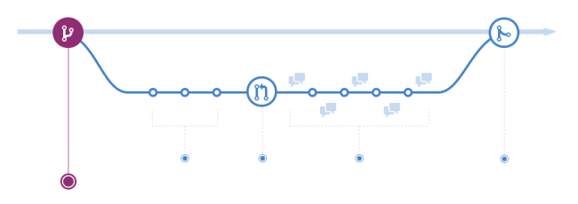
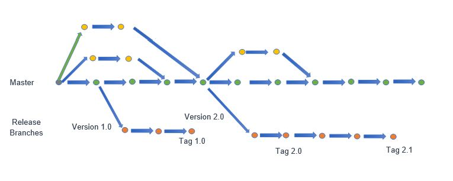

# Git Workshop {bgcss=sea-gradient x=0 y=0 rz=-.1 .light-on-dark}

{ height=46px width=110px }

# Architecture {bgcss=sea-gradient x=0 y=0 rz=-.1 .light-on-dark}

# Architecture - directed acyclic graph

> The history in Git is formed from the commit objects and creates a directed acyclic graph


# Architecture - Git-Workflow

{ height=80% width=80% }

> Recommended sequence: commit &rarr; pull &rarr; push

# Branching Strategies {rx=1 bgcss=sea-gradient .light-on-dark}

- GitFlow

- GithubFlow

- Trunk-Based Development

# Branching Strategies - GitFlow

## Pros

- isolated features ensure you have no need to freeze development or master branch for release preparation

- code in master remains clean and organized. Only updated with tested code

- easy traceability as merges are bundled and clearly labeled

- conductive to the distribution of traditional software

## Cons

- Many branches with complicated rules

- Heavy maintenance workload for released versions

- structured and specific development path conflict with agile iterative approach


# Branching Strategies - GitFlow

## Pros

- clear and simple collaboration rules

- Continuous integration and deployment

- Less risk of technical debt with this branching strategy

## Cons

- Speed comes at cost of less organized workflow in comparison to Git-Flow

- This branching stratey emphasizes constant deployment. Limitation for teams that tent to make larger releases or test several features together

- release preparation and bug fixes happen both in master branch -> requires attention

# Branching Strategies - Github-Flow



# Branching Strategies - Trunk-Based-Development



# Important commands {bgcss=sea-gradient x=0 y=0 rz=-.1 .light-on-dark}

# Important commands: showing the history

```bash
git log --decorate --graph --oneline --all
```

# cool looking {bg=white;assets/paperclip.gif .light-on-dark rx=-1 ry=0}

leverages battle-proven</br>HTML5 presentation frameworks:

revealjs • impressjs

# asciiart (ditaa) {.ltr rx=0 ry=1}

```{.render_ditaa args="--transparent --scale 1 --font 'Raleway'"}

+-----------------------------+
| Node A                      |
|                             |
| +----------+   +----------+ |
| |          |   |          | |
| | Frontend |   | Foo      | |
| |          |   |          | |
| |          |   | {s}      | |
| +-----+----+   +----------+ |
|       ^                     |
|       |                     |
|       \-service-\           |
|                 |           |
+-----------------|-----------+
                  |
+-----------------|-----------+
| Node B          |           |
|       /---------/           |
|       |                     |
|       v                     |
| +-----+----+   +=---------+ |
| |          |   |          | |
| | Frontend |   | Bar      | |
| |          |   |          | |
| |          |   | {s}      | |
| +----------+   +----------+ |
+-----------------------------+

```

# asciiart (a2s) {.ltr}

```render_a2s
#--------------------.
|[0]                 |
| .---# .---# #---.  |
| |[1]| |[1]| |[1]|  |
| #---' #---' '---#  |
|   ^     ^     ^    |
#---+-----+-----+----#
|   |     |     |    |
|   a     2 sketch   |
'--------------------#

[0]: {"fill": "#933","a2s:delref":true}
[1]: {"fill": "#bbb","a2s:delref":true,"a2s:type":"storage"}
```

# asciiart (sketchy) {.ltr}

```render_a2sketch

#-----------------------------#
|[0]                          |
| Node                        |
|                             |
| #----------#   #----------# |
| |          |   |[1]       | |
| |front     |   | foo      | |
| |          |   |          | |
| |  ^       |   |          | |
| |  |       |   |          | |
| #--|-------#   #----------# |
|    |                ^       |
|    |                |       |
|    '-- service    --'       |
|                             |
#-----------------------------#
[0]: {"fill":"#fff","fillStyle":"solid","a2s:delref":true}
[1]: {"fill":"#eee","fillStyle":"solid","a2s:delref":true}
```

# asciiart (svgbob) {.ltr rx=-1 ry=0}

```{.render_svgbob args="--scale 10 --font-family Raleway --font-size 24"}

        P *
           \
            \
       v0    \       v3
         *----\-----*
        /      v X   \
       /        o     \
      /                \
  v1 *------------------* v2
```

# asciiart (mermaid) {.ltr}

```{.render_mermaid args="-w 400" style="font-size: 100%;"}
graph LR
   a --> b & c--> d
```

# asciiart (plantuml) {.ltr}

```{.render_plantuml args="-Sbackgroundcolor=transparent -SdefaultFontSize=24 -SdefaultFontName=Raleway"}
@startuml
Bob->Alice : hello
Alice->Bob : oh, you again...
Bob->Alice : ??
@enduml
```

# asciiart (graphviz) {.ltr}

```{.render_dot args="-Nfontname=Raleway"}
digraph G {
    bgcolor=transparent;
    node [style=filled,color=white];

    a -> b -> c;
    a -> c;
    b -> d;
}
```

# charts (vega-lite) {.ltr rx=0 ry=-1}

```render_vegalite
{
    "$schema": "https://vega.github.io/schema/vega-lite/v2.0.json",
    "data": {
        "values": [
            {"a": "A","b": 28}, {"a": "B","b": 55}, {"a": "C","b": 43},
            {"a": "D","b": 91}, {"a": "E","b": 81}, {"a": "F","b": 53},
            {"a": "G","b": 19}, {"a": "H","b": 87}, {"a": "I","b": 52}
        ]
    },
    "width": 250,
    "height": 300,
    "mark": "area",
    "encoding": {
        "x": {"field": "a", "type": "ordinal"},
        "y": {"field": "b", "type": "quantitative", "scale": {"domain": [0, 100]}}
    },
    "config": {
        "axis": {
            "labelFont": "Raleway",
            "labelFontSize": 18,
            "titleFont": "Raleway",
            "titleFontSize": 24,
            "titleAngle": 0
        },
        "axisX": {
            "labelAngle": 0
        }
    }
}
```
